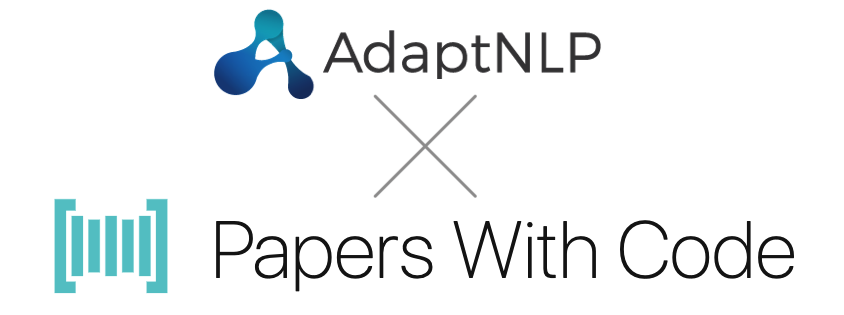

# AdaptNLP Multi-label Classifier - PapersWithCode

## AdaptNLP

AdaptNLP allows users ranging from beginner python coders to experienced machine learning engineers to leverage
state-of-the-art NLP models and training techniques in one easy-to-use python package.

Built atop Zalando Research's Flair and Hugging Face's Transformers library, AdaptNLP provides Machine
Learning Researchers and Scientists a modular and **adaptive** approach to a variety of NLP tasks with an
**Easy** API for training, inference, and deploying NLP-based microservices.

**Key Features**

  - **[Full Guides and API Documentation](https://novetta.github.io/adaptnlp)**
  - [Tutorial](https://github.com/Novetta/adaptnlp/tree/master/tutorials) Jupyter/Google Colab Notebooks
  - Unified API for NLP Tasks with SOTA Pretrained Models (Adaptable with Flair and Transformer's Models)
    - Token Tagging 
    - Sequence Classification
    - Embeddings
    - Question Answering
    - Summarization
    - Translation
    - Text Generation
    - <em> More in development </em>
  - Training and Fine-tuning Interface
    - Integration with Transformer's Trainer Module for fast and easy transfer learning with custom datasets
    - Jeremy's **[ULM-FIT](https://arxiv.org/abs/1801.06146)** approach for transfer learning in NLP
    - Fine-tuning Transformer's language models and task-specific predictive heads like Flair's `SequenceClassifier`
  - [Rapid NLP Model Deployment](https://github.com/Novetta/adaptnlp/tree/master/rest) with Sebastián's [FastAPI](https://github.com/tiangolo/fastapi) Framework
    - Containerized FastAPI app
    - Immediately deploy any custom trained Flair or AdaptNLP model
  - [Dockerizing AdaptNLP with GPUs](https://hub.docker.com/r/achangnovetta/adaptnlp)
    - Easily build and run AdaptNLP containers leveraging NVIDIA GPUs with Docker

